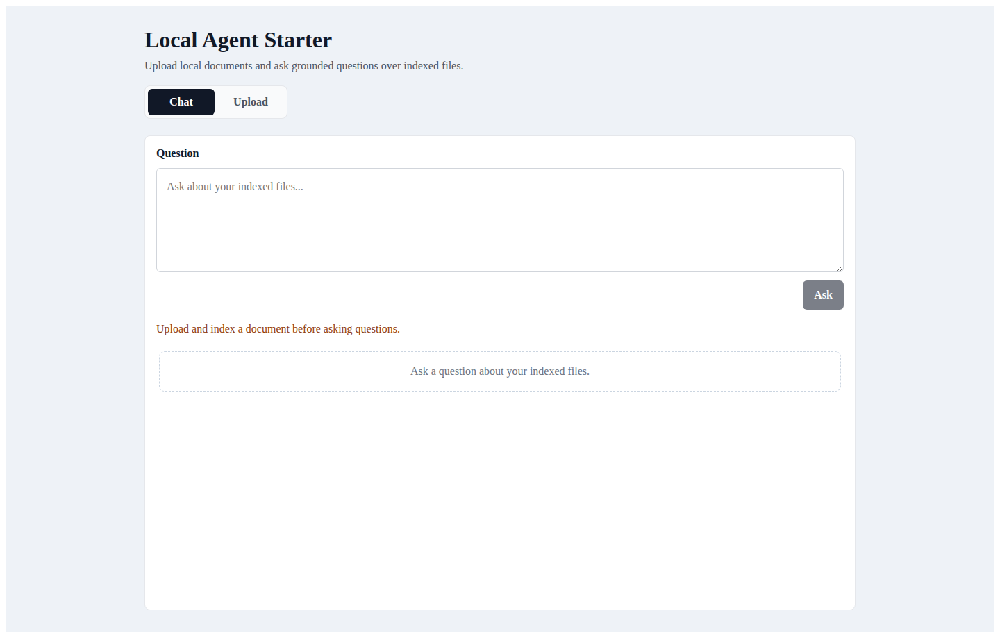
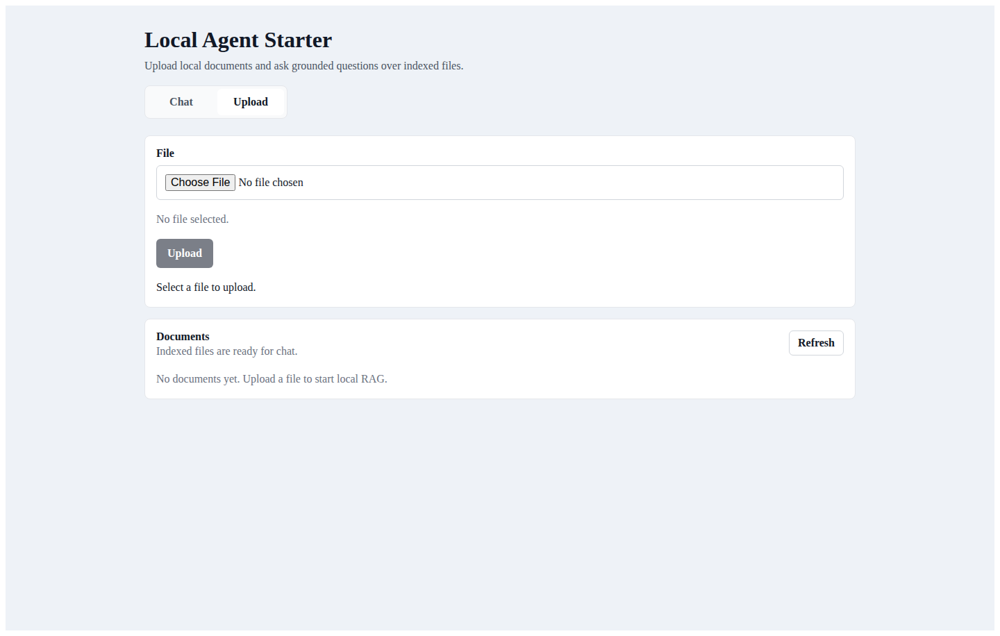
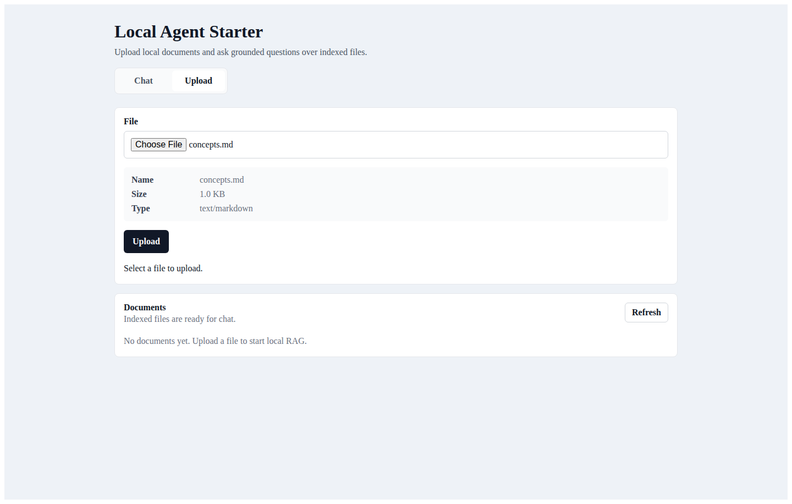
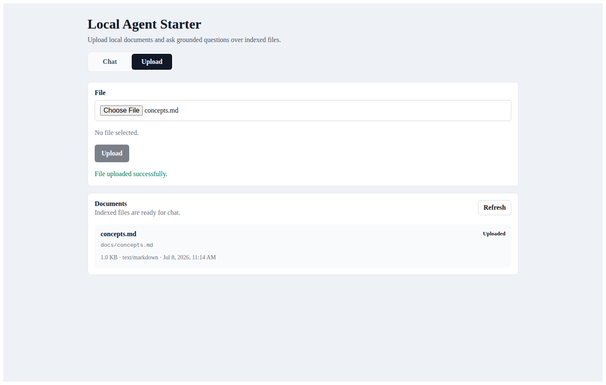
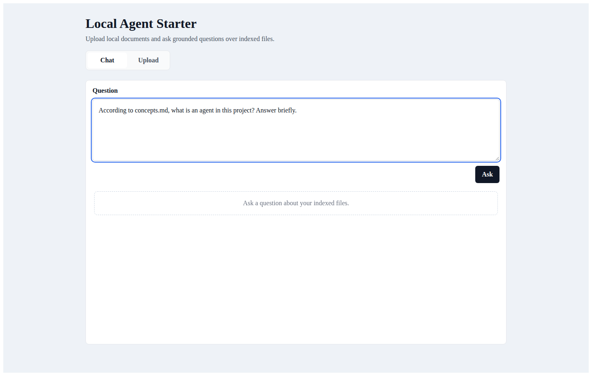
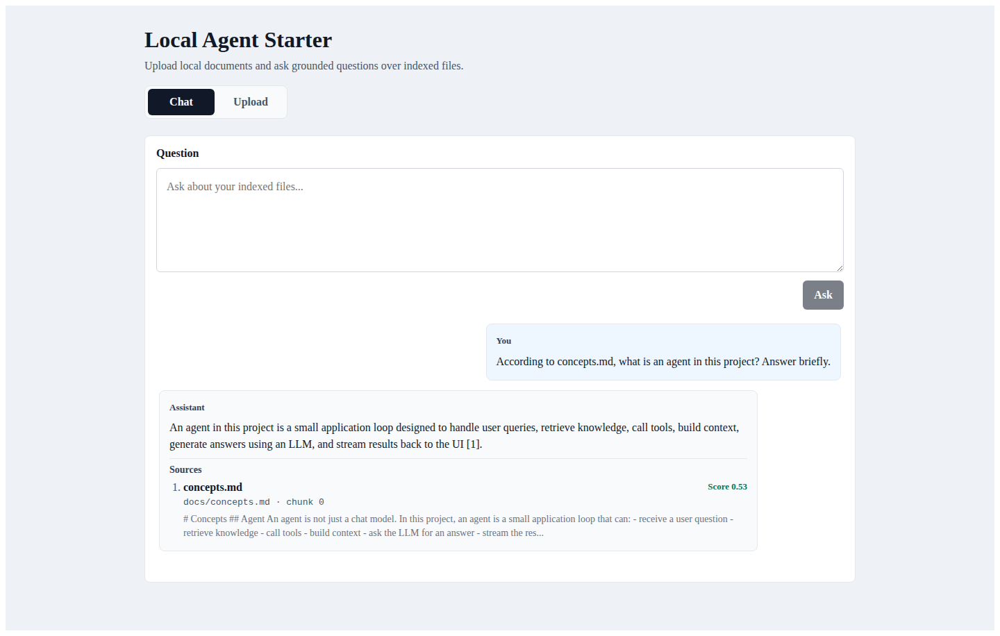
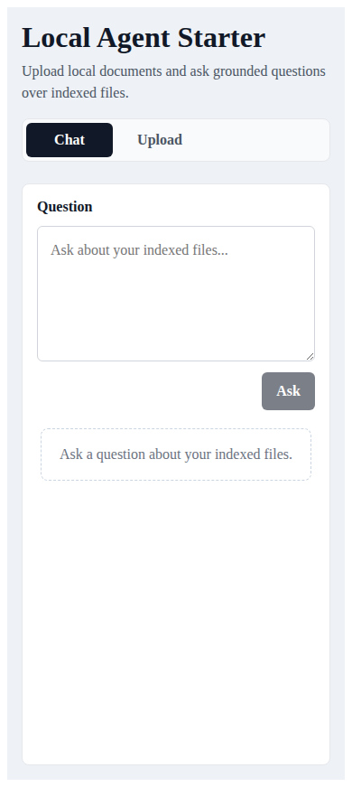
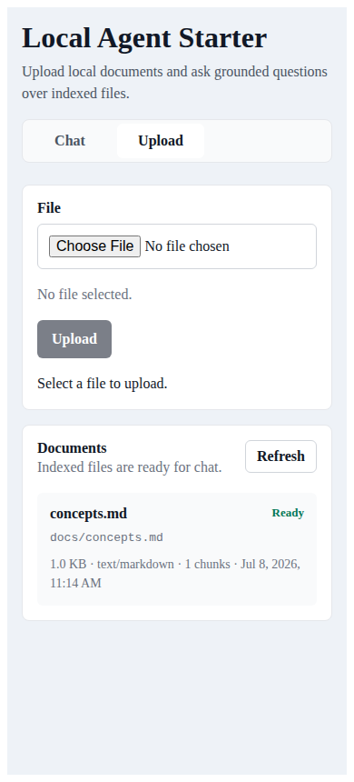

# Reproducible demo

<video controls src="screenshots/demo-flow.webm" width="100%"></video>

This walkthrough demonstrates upload, background indexing, pgvector retrieval,
streaming chat, sources, and application-level trace events.

## Prerequisites

- Docker with Compose
- LM Studio with the configured chat and embedding models
- enough RAM/VRAM for those models
- ports 3000, 3002, 3003, 5432, and 5433 available (or overridden in `.env`)

Follow [LM Studio setup](lm-studio.md), including both curl smoke tests. Docker
builds the app, so Node/Yarn are not required solely to run Compose.

## Start cleanly

For a repeatable demo with disposable database data:

```bash
cp .env.example .env
docker compose down -v
docker compose up -d --build
```

`down -v` deletes Postgres metadata and indexed chunks. It does not clear the
separate `docker/docs` bind mount; remove old uploads there only if you intend
to discard them. For ordinary use, prefer the non-destructive `yarn start`.

Wait for services, then check:

```bash
docker compose ps
curl http://localhost:3002/healthcheck
curl http://localhost:3003/healthcheck
curl http://localhost:3000/files
```

## Browser script

1. Open `http://localhost:3000` (the full Docker app, not the UI-only dev
   server at port 3001).
2. Open **Upload** and choose `docs/concepts.md`.
3. Submit the upload. Expect file status progression from uploaded/indexing to
   **Ready**, which corresponds to persisted status `indexed`.
4. Open **Chat** and enter exactly:

   ```text
   According to concepts.md, what is an agent in this project? Answer briefly.
   ```

5. Submit and watch the answer stream.

A successful result should briefly describe an agent as an application that
combines a model with context/tools/workflow. It should show one or more source
previews from `concepts.md`, finish the stream, and show completed visible
application pipeline events. Exact prose varies by model; the UI does not show
hidden chain of thought.

## Screenshot sequence














## Mobile screenshots





## If the demo fails

Capture service state and bounded logs before resetting anything:

```bash
docker compose ps
docker compose logs --tail=200 api chat indexer postgres
```

Follow the component that fails: `api` for upload/status, `indexer` for queued
or failed indexing, `chat` for retrieval/streaming, and `postgres` for schema or
connection errors. See [troubleshooting](troubleshooting.md) for targeted checks
and the difference between a restart and a destructive reset.
